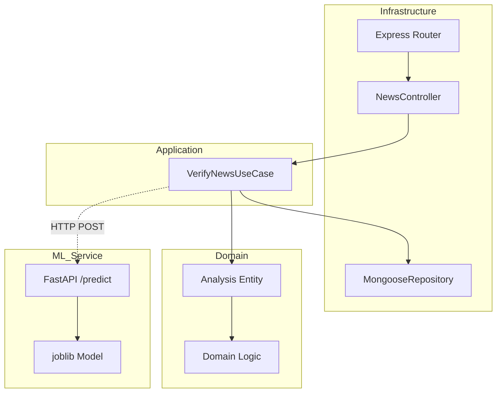
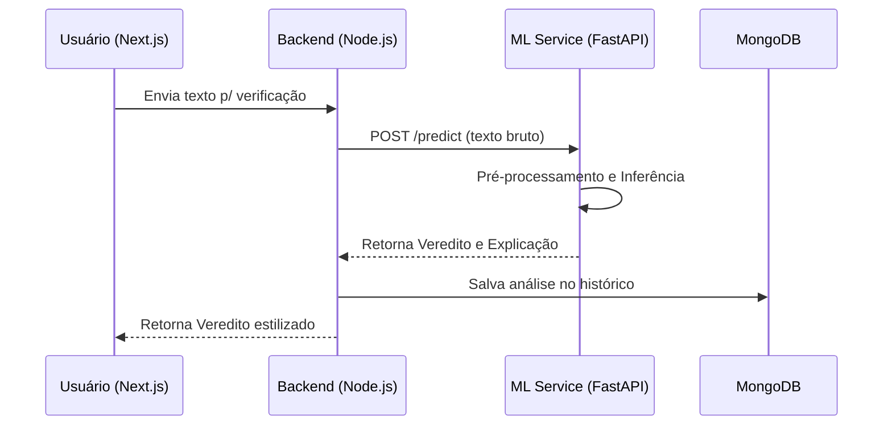

# Scandit.AI — Arquitetura do Sistema 🏰📊

Esta documentação detalha a estrutura técnica e o fluxo de dados do projeto.

## 🏗️ Clean Architecture (Backend)

O backend foi projetado seguindo os princípios da **Arquitetura Limpa** de Robert C. Martin, garantindo que a lógica de negócio seja independente de banco de dados, frameworks e ferramentas externas.

### Explicação das Camadas:
- **Domain**: O núcleo. Define "O que é uma Análise" e quais são as regras de veracidade.
- **Application**: Orquestra o fluxo. Chama a IA, pede para o repositório salvar e retorna o resultado.
- **Infrastructure**: Onde o Express e o Mongoose residem. São apenas ferramentas que podem ser trocadas sem afetar o core do sistema.

## 🤖 Fluxo de Verificação de Fake News

## 🛡️ Hardening e Resiliência
- **Desacoplamento**: Se o serviço de IA cair, o Backend continua servindo o histórico e o login normalmente.
- **Timeout Proativo**: O Backend espera no máximo 15s pela IA para não deixar o usuário pendurado.
- **Segurança Nativa**: Filtros de entrada e cabeçalhos de proteção (HSTS, CSP, XSS-Filter).

---
